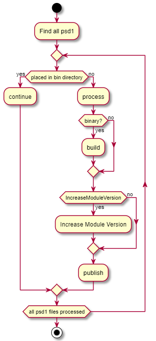

<!--Category:Powershell--> 
 <p align="right">
    <a href="https://www.powershellgallery.com/packages/ProductivityTools.PSPublishModuleTo/"></a>
    <a href="http://productivitytools.tech/publish-moduleto/"><a> 
    <a href="https://github.com/pwujczyk/ProductivityTools.PSPublishModuleTo"></a>
</p>
<p align="center">
    <a href="http://productivitytools.tech/">
        
    </a>
</p>

# Publish-ModuleTo


Publishing module to PowerShell gallery is very straight-forward task. To do it we just need to invoke command

```powershell
Publish-Module -NuGetApiKey $nuGetApiKey -Name $fullPath
```

If we are pushing to different repository than default, we also can provide **PSRepository** parameter.

```powershell
Publish-Module -PSRepository $psRepository -NuGetApiKey $nuGetApiKey -Name $fullPath
```

As I am publishing a lot I automated this repeatable task. Described module allows to be invoked in the directory of the module without pointing out exact psd1 file. Cmdlet will find it and process.

If a target module is binary one it will rebuild application and publish the newest version.

Also the **Publish-ModuleTo** allows to use **UpdateModuleVersion** switch, which will increase patch number (z in  X.Y.Z).

This module is base for other, more specific one. Please check out [Publish-ModuleToPowershellGallery](http://productivitytools.tech/publish-moduletopowershellgallery/)

## Examples 

Go to the directory of the module and invoke
```powershell
Publish-ModuleTo -PSRepository PSGallery -PSRepositoryApiKey PSGalleryApiKey -Verbose

Publish-ModuleTo -PSRepository PSGallery -PSRepositoryApiKey PSGalleryApiKey -Verbose -IncreaseModuleVersion
```

## Switches
- IncreaseModuleVersion - it will increase patch number in the target module

## Diagram

